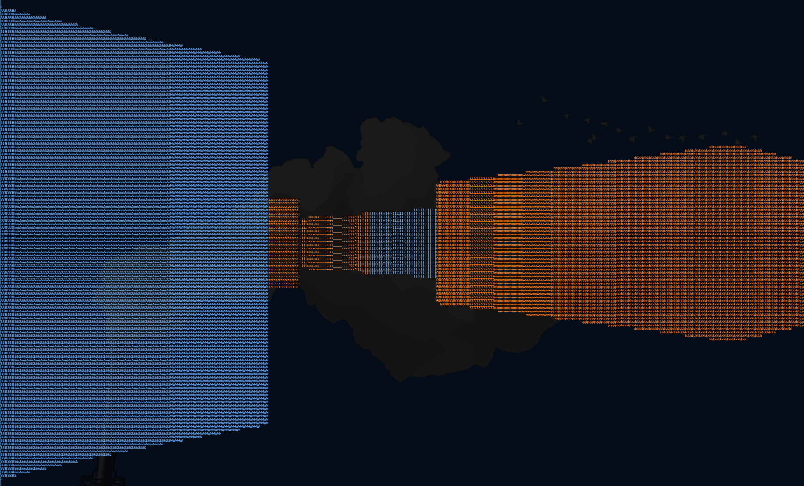

## the world's worst rendering engine



<img src="https://github.com/xenofurious/ascii-raycaster/tree/master/examples/mazegame.png" alt="screenshot of game")

A Hovertank-3D style renderer running entirely inside the terminal

## How to install

Run this command in the directory you'd like to clone it in
```bash
git clone "https://github.com/xenofurious/ascii-raycaster"
```
... and then build using
```bash
gcc main.c render.c raycast.c linalg.c map_data.c gameloop.c -lncurses -lm -o mazegame
```

This should build an executable file mazegame which you should be able to run by doing:
```bash
./mazegame
```
... in your current directory.


i'm like less than one month into learning c so please be gentle qwq
